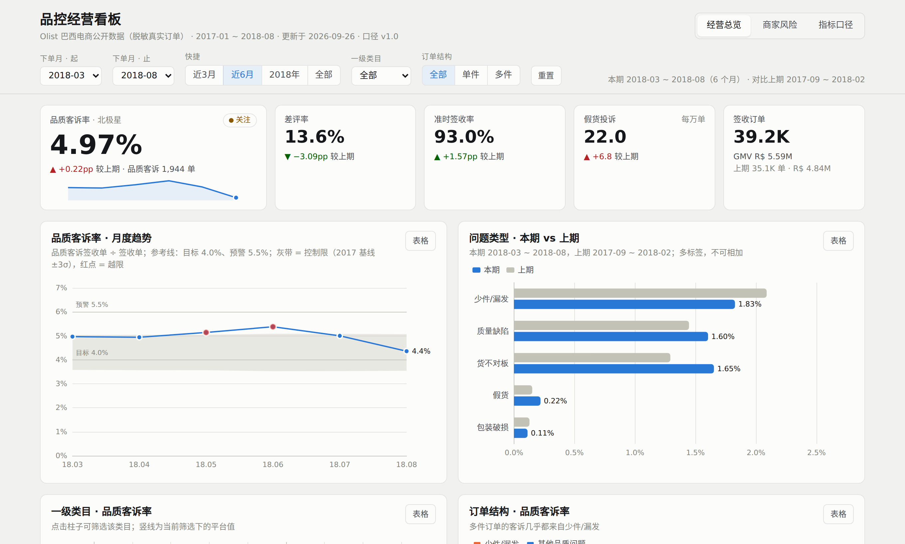

# 电商品控数据分析项目

差评在降，品质客诉在升

用 Olist 巴西电商平台公开的约 10 万笔**真实订单**，按 JD 的四项职责做了四件可交付的东西：品控指标体系、经营看板、专题分析、SQL 取数题库。



## 核心结论

- **差评率由物流主导，不能用来评价品控**：2018 年 3 月准时签收率跌到 81.0%，差评率冲到 22.8%；物流恢复后 8 月回落到 10.9%。
- **品质客诉率在上升，且不是随机波动**：2017 年 4.31% → 2018 年 1-8 月 5.00%（两比例 z 检验 p < 0.0001；p 控制图上自 2017 年 10 月起连续 11 个月高于基线）；差评中品质问题的占比从 22% 升到 35%。因素分解显示上升全部来自同类订单变差（组内效应 +0.74pp，结构效应 −0.01pp），增长最快的是货不对板（+33%）和假货（+83%）。
- **三个瓶颈**：多件订单占 10% 签收单、贡献 34% 品质客诉（几乎都是少件漏发）；10 家高风险商家占 3.6% 订单、贡献 12.5% 客诉；办公家具少配件、3C / 钟表假货、信息缺失商品风险高。
- **放到唯品会的品类结构下**：穿戴类品质客诉率涨得更快（3.7% → 5.1%）；按唯品会穿戴类约 75% 的结构重新加权，假货投诉从每万单 22 翻倍到 45。
- **治理测算**：多件订单出库复核、高风险商家整改、3C / 钟表正品专项，三项叠加中性情景可把品质客诉率从 5.00% 降到 3.82%（三档情景 3.34%–4.32%）。高风险商家名单经过回测：下一期客诉率仍是平台的 2.2 倍。

## 交付物

| JD 职责 | 交付物 | 位置 |
|---|---|---|
| ① 指标体系建设 | 北极星 + 31 个指标、6 条口径约定、口径变更记录；基准值由口径 SQL 实跑得到 | [指标体系说明](docs/02_指标体系.md) · [指标字典.xlsx](docs/品控指标字典.xlsx) |
| ② 可视化看板 | 3 页交互看板（总览 / 商家风险 / 指标口径，趋势图带 p 控制图控制限）；Power BI、Tableau、SmartBI 搭建指南；Tableau Public 逐步搭建清单 | [dashboard/index.html](dashboard/index.html)（本地双击打开）· [搭建指南](docs/04_BI看板设计与搭建指南.md) · [Tableau Public 清单](docs/07_Tableau_Public搭建清单.md) · [BI 导入数据](dashboard/bi_data/) |
| Excel 报表 | 商家品质月报模板：改参数页的月份和阈值，SUMIFS / INDEX-MATCH 公式自动重算商家分层，附透视表和条件格式；分层结果与数仓评分卡逐一对账 | [商家品质月报模板.xlsx](docs/商家品质月报模板.xlsx) |
| ③ 专题分析 | 假设驱动的分析报告（Word + Markdown）、24 页汇报 PPT（20 页正文 + 4 页附录，原生图表 + 讲稿备注）；进阶分析：控制图、显著性检验、商家分层回测、三档情景与敏感性、差异化抽检增益曲线、唯品会品类视角 | [报告.docx](report/品控专题分析报告.docx) · [报告.md](docs/03_专题分析报告.md) · [PPT](ppt/品控数据分析项目_面试汇报.pptx) · [进阶分析明细](outputs/advanced_tables.xlsx) |
| ④ 取数与 SQL | 19 道业务取数题：业务原话 → 口径 → SQL → 自检 → 错误写法对比 → 追问，全部在 MySQL 8.0 实跑 | [题库（答案版）](docs/05_SQL面试题库.md) · [练习版](docs/05_SQL面试题_练习版.md) · [SQL 文件](sql/interview/) |
| 数据核查 | 数据说明与清洗规则、18 项自动校验；评价打标两轮评估：分层抽样 140 条看准确率，随机 200 条盲评看准确率 + 召回率（97.4% / 74.5%） | [数据说明](docs/01_数据说明与清洗规则.md) · [校验报告](outputs/qa/dq_report.md) · [分层复核样本](outputs/qa/tag_validation_sample.csv) · [随机金标准集](outputs/qa/tag_gold_set.csv) |
| 外部参考 | 市场监管总局电商抽检结果、唯品会品类结构（来自新闻转载与财报报道，附出处） | [data/external/](data/external/) |
| 面试准备 | JD 对照表、三分钟陈述稿、演示顺序、追问与回答要点（含控制图、召回率、回测、抽检、唯品会视角） | [面试讲述与问答准备](docs/06_面试讲述与问答准备.md) |

## 方法概览

```
Olist 原始 CSV（8 张表，行数与官方一致）
   │  scripts/01_load_ods.py
   ▼
ODS 贴源层 ──► DWD 明细层（评价去重、订单宽表、时间倒挂打标）
                 │  scripts/03_tag_reviews.py：葡语评价 → 8 类问题标签（随机盲评：准确率 97%、召回率 75%）
                 ▼
             dwd_qc_order 品控宽表（一单一行，所有指标的唯一口径来源）
                 ▼
             DWS 商家×月 / 品类×月（只存计数）──► ADS 月度 KPI / 商家品质分 / 品类排行 / 看板数据集
                 │  scripts/07_data_quality_check.py：18 项校验，全部通过才出数
                 ▼
   专题分析（08）· 指标字典（09）· 看板（10）· SQL 题库（11）
   进阶分析（13）· 打标金标准评估（14）· Excel 月报模板（15）· PPT / 报告（12 + Node）
```

## 复现

需要 MySQL 8.0、Python 3.10+、Node 18+；生成 Excel 模板的透视表需要 LibreOffice（`soffice`）。

```bash
pip install -r requirements.txt

# MySQL 连接参数通过环境变量设置（默认 localhost:3306，账号 analyst/analyst）
export MYSQL_USER=... MYSQL_PASSWORD=...

python scripts/run_pipeline.py          # 入库 → 数仓 → 打标 → 校验 → 分析 → 字典 → 看板 → 题库 → 进阶分析 → 金标准评估 → Excel 模板

cd ppt && npm install && node build_deck.js          # 生成 PPT
cd ../report && npm install && node build_report.js  # 生成 Word 报告
```

原始数据已随仓库提供（`data/raw/*.csv.gz`）；需要重新下载时运行 `python scripts/00_download_data.py`，脚本会校验行数与官方一致。

## 目录结构

```
data/raw/          原始数据（gzip）          data/dim/        品类中文维表（人工整理）
data/external/     外部参考（监管抽检、唯品会品类结构，附出处）
sql/               数仓分层 SQL              sql/interview/   面试库建表与 19 道题答案
scripts/           Python 全流程（00-15）    dashboard/       HTML 看板、BI 导入数据
docs/              各模块说明文档与指标字典    outputs/         分析结果、图表、数据质量报告
ppt/               PPT 与生成脚本            report/          Word 报告与生成脚本
```

## 关于打标评估，需要说明的一点

两轮打标评估（140 条分层样本、200 条随机金标准）的逐条判定，都是借助大模型（Claude）阅读葡语原文完成的，不是人工逐条标注。每条样本都附了中文释义和判定结果（见 `outputs/qa/`），可以直接人工抽查。判定结果据实使用，不在任何材料里称作"人工复核"。

## 数据来源与声明

- 数据：[Olist Brazilian E-Commerce Public Dataset](https://www.kaggle.com/datasets/olistbr/brazilian-ecommerce)（CC BY-NC-SA 4.0），巴西电商平台脱敏真实订单；本仓库使用的是 GitHub 上的 gzip 镜像，行数与官方一致。
- 外部参考数据（`data/external/`）取自监管公告的新闻转载和财报报道，数字引用前应核对原文。
- 本项目是个人求职作品，不代表唯品会或 Olist 的任何观点，所用数据与唯品会无关；文中"唯品会品控"的对应关系仅用于说明方法如何迁移。
