# 02 品控指标体系设计

> 对应 JD 职责 1：**协助产品经理梳理并完善品控体系的业务核心指标及过程指标，确保口径统一，推动指标字典的维护与落地。**
>
> 配套文件：[`品控指标字典.xlsx`](品控指标字典.xlsx)（6 个 sheet：说明 / 指标体系 / 指标字典 / 维度字典 / 问题类型字典 / 口径变更记录）

## 1. 先定北极星：为什么是"品质客诉率"，而不是"差评率"

| 候选 | 问题 | 结论 |
|---|---|---|
| 差评率 | 被物流主导：2018-03 物流危机时差评率冲到 **22.8%**，4 月物流恢复后立刻回落到 13%，品控什么都没做。品控团队背一个自己控制不了的指标，没法考核也没法复盘 | 作为**护栏指标**保留 |
| 平均评分 | 同上，且均值会被极端值拉动 | 辅助 |
| **品质客诉率** | 只统计"商品本身出了问题"的订单（假货 / 质量缺陷 / 货不对板 / 少件漏发 / 包装破损），剔除了物流、服务噪音，**品控能直接影响、能拆解到品类/商家/商品** | ✅ 北极星 |

一句话定义：**签收订单中，用户因商品本身问题给出 1-3 星并在评价中描述该问题的订单占比。**

> 唯品会场景下，品质客诉率还应与"品质退货率"（售后退货原因 = 品质类）互相印证：前者看"用户说了什么"，后者看"用户做了什么"。公开数据没有退货表，已在字典中定义为待接入指标 IN604。

## 2. 指标体系结构

```mermaid
flowchart LR
    NSM["L0 北极星<br/>QC001 品质客诉率<br/>基准 5.00%"]

    subgraph R["L1 结果指标"]
      direction TB
      Q1["QC101 少件/漏发率 1.90%"]
      Q2["QC102 质量缺陷率 1.59%"]
      Q3["QC103 货不对板率 1.60%"]
      Q4["QC104 假货投诉率 22.0/万单"]
      Q5["QC105 包装破损率 0.12%"]
      E1["EX201 差评率 14.76%（护栏）"]
      E4["EX204 差评品质原因占比 27.16%"]
    end

    subgraph P["L2 过程指标（按品控链路）"]
      direction TB
      P1["商品准入<br/>PD301 动销商品信息完整率<br/>PD303 高风险品类订单占比"]
      P2["商家管理<br/>SP401 发货超时率<br/>SP403 高风险商家数<br/>SP405 商家品质分"]
      P3["仓配履约<br/>FF501 准时签收率<br/>FF504 多件订单少件率"]
      P4["待接入（内部数据）<br/>IN601 入仓质检合格率<br/>IN603 问题商品拦截率<br/>IN604 品质退货率"]
    end

    NSM --> R
    R --> P
```



**三种拆法，回答三个问题：**

1. **按问题类型拆（What）**：品质客诉率 → 少件漏发 / 质量缺陷 / 货不对板 / 假货 / 包装。每类问题对应不同的责任方和治理手段（少件→仓配出库，缺陷→供应商质检，货不对板→商品详情/发货，假货→准入与授权）。
2. **按品控链路拆（Where）**：商品准入 → 商家发货 → 仓配 → 签收 → 客诉处理 → 商家治理闭环。每个环节有一个过程指标，结果指标出问题时顺着链路往前找。
3. **按对象拆（Who）**：一级类目 → 品类 → 商家 → 商品。

   平台品质客诉率 = Σ（品类订单占比 × 品类品质客诉率），所以平台指标变化 = **结构效应**（高客诉品类卖多了）+ **组内效应**（同一品类变差了）。专题分析里用这个公式证明了 2018 年的上升 **100% 来自组内恶化**，结构效应≈0。

**结果指标 vs 过程指标**：结果指标是滞后的（用户签收、评价之后才知道），过程指标是领先的（发货超时、信息缺失在用户收货前就能看到）。日常经营看结果，预警和治理抓过程。

**怎么判断"变了"**：北极星按月画 p 控制图，以稳定期（2017 年）为基线，控制限 = p0 ± 3√(p0(1−p0)/n)，n 为当月签收单，所以单量小的月份控制限更宽。单点越出上控制限、或连续 9 个月在中心线同一侧，才判为异常，避免把随机波动当成趋势。看板趋势图的灰带就是这条控制限。

## 3. 口径统一：六条约定

| # | 约定 | 为什么 |
|---|---|---|
| 1 | **时间一律按下单月归属**（cohort） | 若分子按评价月、分母按签收月，会出现"本月客诉来自上月订单"的错配，月初数据尤其失真 |
| 2 | **签收口径** = status 为 delivered 且签收时间非空 | 源数据有 8 单状态为已签收但没有签收时间 |
| 3 | **一单一评**：同一订单多条评价时保留最后一次提交 | 547 单有多条评价，不去重会重复计数 |
| 4 | **品质客诉只认 1-3 星** | 4-5 星里"sem defeito（没有瑕疵）"会被关键词误命中 |
| 5 | **问题类型多标签；需要互斥结构时用主标签**（按优先级：假货 > 缺陷 > 货不对板 > 少件 > 包装 > 未收货 > 延迟 > 服务） | 一条评价可能同时说"坏了又晚到"。各类型发生率之和 ≠ 品质客诉率，不能相加 |
| 6 | **DWS 只存计数，比率在最后一步算** | 各品类客诉率的简单平均 ≠ 平台客诉率（辛普森悖论的来源之一） |

所有看板、周报、专题分析都从同一张宽表 `dwd_qc_order` 取数；每次跑数后执行 18 项数据质量校验（跨层对账、主键唯一、分子≤分母等），见 [`outputs/qa/dq_report.md`](../outputs/qa/dq_report.md)。

## 4. 指标清单（基准值 = 2018 年 1-8 月，由字典中的口径 SQL 实跑得到）


### L0 北极星

| 编码 | 指标 | 定义 | 公式 | 基准值 | 目标/预警 |
|---|---|---|---|---|---|
| QC001 | **品质客诉率** | 签收订单中，用户因商品本身问题（假货/质量缺陷/货不对板/少件漏发/包装破损）给出 1-3 星并在评价中描述该问题的订单占比。衡量"用户收到的东西有没有问题"。 | 品质客诉签收单数 ÷ 签收订单数 | 5.00% | 目标 ≤ 4.0%；预警 > 5.5% |

### L1 结果-品质拆解

| 编码 | 指标 | 定义 | 公式 | 基准值 | 目标/预警 |
|---|---|---|---|---|---|
| QC101 | **少件/漏发率** | 签收后用户反馈少发、漏发、缺配件的订单占比。 | 少件漏发客诉签收单 ÷ 签收订单数 | 1.90% | 预警 > 2.0% |
| QC102 | **质量缺陷率** | 签收后用户反馈商品破损、功能故障、做工差、临期过期的订单占比。 | 质量缺陷客诉签收单 ÷ 签收订单数 | 1.59% | 预警 > 1.8% |
| QC103 | **货不对板率** | 签收后用户反馈错发、颜色/尺码/型号与描述不符、实物与图片不符的订单占比。 | 货不对板客诉签收单 ÷ 签收订单数 | 1.60% | 预警 > 1.5% |
| QC104 | **假货投诉率** | 签收后用户反馈非正品、高仿、非原装的订单占比（唯品会"正品保障"的核心红线）。 | 假货客诉签收单 ÷ 签收订单数 × 10000 | 22.0 | 红线：单品类 > 30/万单 即启动专项 |
| QC105 | **包装破损率** | 签收后用户反馈外包装破损、被拆、简陋无防护的订单占比。 | 包装问题客诉签收单 ÷ 签收订单数 | 0.12% | 预警 > 0.2% |

### L1 结果-体验

| 编码 | 指标 | 定义 | 公式 | 基准值 | 目标/预警 |
|---|---|---|---|---|---|
| EX201 | **差评率** | 已评价订单中 1-2 星订单占比。综合反映品质 + 履约 + 服务，是品质客诉率的"护栏指标"。 | 1-2 星订单数 ÷ 有评价订单数 | 14.76% | 预警 > 15% |
| EX202 | **平均评分** | 有评价订单的平均星级。 | 评分之和 ÷ 有评价订单数 | 4.09 | 预警 < 4.0 |
| EX203 | **5 星好评率** | 有评价订单中 5 星占比。 | 5 星订单数 ÷ 有评价订单数 | 58.23% | — |
| EX204 | **差评品质原因占比** | 1-2 星差评中，命中品质类问题的占比。回答"差评里有多少是品控能管的"。 | 品质客诉差评单 ÷ 差评单 | 27.16% | — |

### L2 过程-商品准入

| 编码 | 指标 | 定义 | 公式 | 基准值 | 目标/预警 |
|---|---|---|---|---|---|
| PD301 | **动销商品信息完整率** | 有销量的商品中，品类、图片、描述三项信息都完整的商品占比。信息缺失商品的假货投诉率是其他商品的 9 倍。 | 信息完整的动销商品数 ÷ 动销商品数 | 98.76% | 目标 100%（准入卡口） |
| PD302 | **信息缺失商品订单占比** | 订单主商品缺失品类/图片/描述信息的订单占比。 | 主商品信息缺失订单数 ÷ 订单数 | 1.14% | 预警 > 1% |
| PD303 | **高风险品类订单占比** | 品质客诉率 ≥ 平台 1.2 倍的品类所产生的订单占比，衡量平台品类结构风险。 | 高风险品类订单数 ÷ 订单数 | 22.31% | — |

### L2 过程-商家管理

| 编码 | 指标 | 定义 | 公式 | 基准值 | 目标/预警 |
|---|---|---|---|---|---|
| SP401 | **商家发货超时率** | 商家交付物流的时间晚于平台发货 SLA（shipping_limit_date）的订单占比。 | 发货超时订单数 ÷ 已出库订单数 | 8.56% | 预警 > 10% |
| SP402 | **平均出库时长** | 下单到商家交付物流的平均天数。 | Σ(出库时间 − 下单时间) ÷ 已出库订单数 | 3.02 | 预警 > 3 天 |
| SP403 | **高风险商家数** | 近 6 个月签收 ≥ 30 单、平滑品质客诉率 ≥ 平台 2 倍且客诉 ≥ 3 单的商家数。（商家评分窗口：2018-03 ~ 2018-08） | COUNT(风险等级 = 高风险) | 10 | 每月清零目标：进入名单 30 天内整改 |
| SP404 | **高风险商家客诉贡献度** | 高风险商家的品质客诉单占参评商家全部品质客诉单的比例。（商家评分窗口：2018-03 ~ 2018-08） | 高风险商家客诉单 ÷ 参评商家客诉单 | 12.47% | — |
| SP405 | **商家品质分** | 商家级综合得分 0-100：品质客诉率 50% + 差评率 20% + 发货超时率 15% + 延迟签收率 15%，各分项按参评商家分位数打分。（商家评分窗口：2018-03 ~ 2018-08） | Σ 权重 × 100 × (1 − PERCENT_RANK) | 50.37 | < 40 分进入观察名单 |
| SP406 | **参评商家订单覆盖率** | 参与品质分评估的商家覆盖的签收订单占比，衡量评分体系的覆盖面。（商家评分窗口：2018-03 ~ 2018-08） | 参评商家签收单 ÷ 全部商家签收单 | 67.94% | 目标 ≥ 70% |

### L2 过程-仓配履约

| 编码 | 指标 | 定义 | 公式 | 基准值 | 目标/预警 |
|---|---|---|---|---|---|
| FF501 | **准时签收率** | 签收日期不晚于承诺送达日期的签收订单占比。 | 1 − 延迟签收单 ÷ 签收订单数 | 92.27% | 预警 < 90% |
| FF502 | **平均送达时长** | 下单到用户签收的平均天数。 | Σ(签收时间 − 下单时间) ÷ 签收订单数 | 12.15 | — |
| FF503 | **多件订单占比** | 签收订单中商品行数 ≥ 2 的订单占比。 | 多件签收单 ÷ 签收订单数 | 9.95% | — |
| FF504 | **多件订单少件率** | 多件签收订单中出现少件/漏发客诉的比例。多件订单占 10% 却贡献 74% 的少件客诉。 | 多件订单少件客诉单 ÷ 多件签收单 | 14.44% | 目标 ≤ 7%（减半） |
| FF505 | **订单取消率** | 订单中被取消或因缺货不可履约的占比。 | (取消 + 不可用) 订单数 ÷ 订单数 | 0.85% | 预警 > 1.5% |
| FF506 | **未收货客诉率** | 用户给出 1-3 星并反馈"没收到货"的订单占比。 | 未收货客诉单 ÷ 订单数 | 4.39% | 预警 > 5% |

### L2 过程-待接入

| 编码 | 指标 | 定义 | 公式 | 基准值 | 目标/预警 |
|---|---|---|---|---|---|
| IN601 | **入仓质检合格率** | 供应商商品入仓时，质检合格的批次（或件数）占比。 | 质检合格批次 ÷ 质检批次 | — | — |
| IN602 | **抽检覆盖率** | 入仓批次中被抽检的比例（高风险供应商应 100%）。 | 抽检批次 ÷ 入仓批次 | — | — |
| IN603 | **问题商品拦截率** | 质检环节拦截下来的问题件占全部问题件（拦截 + 流出后被客诉）的比例，衡量质检有效性。 | 质检拦截问题件 ÷ (质检拦截问题件 + 签收后品质客诉件) | — | — |

### L1 结果-品质拆解

| 编码 | 指标 | 定义 | 公式 | 基准值 | 目标/预警 |
|---|---|---|---|---|---|
| IN604 | **品质退货率** | 因品质原因（质量问题/货不对板/少件/假货）发生的退货件数占签收件数比例；与品质客诉率互为印证。 | 品质原因退货件 ÷ 签收件 | — | — |

### L2 过程-待接入

| 编码 | 指标 | 定义 | 公式 | 基准值 | 目标/预警 |
|---|---|---|---|---|---|
| IN605 | **客诉首次响应时长** | 客诉工单创建到首次响应的时长中位数。 | MEDIAN(首次响应时间 − 工单创建时间) | — | — |
| IN606 | **高风险商家整改闭环率** | 进入高风险名单的商家中，30 天内完成整改且复评不再高风险的比例。 | 整改闭环商家数 ÷ 应整改商家数 | — | 目标 ≥ 80% |

## 5. 公开数据的边界 & 如何接入唯品会真实数据

| 唯品会品控真实环节 | 本项目数据 | 处理 |
|---|---|---|
| 供应商 / 品牌方 | Olist 商家（seller） | 直接映射 |
| 入仓质检、抽检 | 无 | 定义 IN601-IN603，待接入 |
| 售后退货原因 | 无 | 定义 IN604 品质退货率，待接入 |
| 客诉工单 | 用户评价文本 + 星级 | 用 NLP 规则打标替代（随机 200 条盲评：准确率 97%、召回率 75%，偏保守） |
| 供应商发货 SLA | shipping_limit_date | 直接映射 |
| 商品详情页质量 | 图片数、描述字数、品类是否缺失 | 直接映射为"商品信息完整率" |

## 6. 指标字典的维护流程

```
业务提需求 → 数分出口径草案（定义/分子/分母/过滤/时间归属） → 与产品/业务评审 → 写入字典 + 实现 SQL
→ 与已有指标对账（同源宽表、交叉校验） → 上线看板 → 口径变更必须记录在"口径变更记录"sheet 并通知使用方
```

本项目的口径本身也经历了 5 个版本（v0.1 → v1.0），每次变更的原因和影响都记录在字典的"口径变更记录"里。
