# 03 专题分析报告：差评率在下降，品质客诉率在上升

> 电商品控专题分析报告：品质问题在哪里、为什么、怎么治理
>
> **数据**：Olist Brazilian E-Commerce Public Dataset（巴西电商平台公开的脱敏真实订单）  
> **分析范围**：下单月 2017-01 至 2018-08，签收订单 96,203 个  
> **术语与口径**：docs/00_术语与口径.md；指标字典 v1.0（docs/品控指标字典.xlsx）  
> **复现**：python scripts/run_pipeline.py（MySQL 8.0）  

> Word 版：[`report/品控专题分析报告.docx`](../report/品控专题分析报告.docx)

## 摘要

1. **结论**：差评率在下降，品质客诉率在上升，而且是持续偏移。品质客诉率从 2017 年的 4.31% 升到 2018 年 1-8 月的 5.00%（z = 5.05，p < 0.0001），控制图上 2017-10 至 2018-08 连续 11 个月高于中心线；差评率随准时签收率变化，下单月 2018-03 准时签收率 81.0%、差评率 22.8%。
2. **原因**：上升来自组内效应（+0.74pp），结构效应只有 −0.01pp；差评品质原因占比从 2017Q1 的 21.9% 升到 2018Q3 的 35.2%。
3. **问题**：集中在三处。多件订单占签收订单 10.0%，贡献 33.6% 的品质客诉订单；10 家高风险商家贡献 12.5% 的商家品质客诉订单；假货集中在电脑配件（66.2 单/万单）和钟表礼品（53.0 单/万单）。
4. **举措**：多件订单出库复核、高风险商家和需关注商家整改、一级类目 3C数码、钟表与潮流好物的正品与商品描述专项，中性情景下把品质客诉率从 5.00% 降到 3.82%（悲观 4.32%，乐观 3.34%）。
5. **可信度**：18 项数据校验全部通过；标注样本 200 条，标签精确率 97.4%、标签召回率 74.5%，2017 年与 2018 年标签召回率相近，上升趋势不会被高估。

## 1. 背景与问题

2018 年差评率从 3 月的高点快速回落，直觉上会认为用户体验在改善。但差评由多种原因混合而成：没收到货、送得慢、服务差、商品本身有问题。品控关心的是其中"商品本身有问题"的部分是否也在改善。本报告回答四个问题：

- 差评率下降，是否代表商品品质在改善？
- 如果品质问题在上升，是结构效应（卖了更多高品质客诉率的类目），还是组内效应（同一类目自身变差）？
- 品质问题集中在哪里：哪个标签、哪类订单、哪些商家、哪些品类？
- 哪些举措可以落地，能把品质客诉率降到多少？

## 2. 数据与口径

### 2.1 数据来源

使用 Olist 公开的巴西电商平台真实订单数据：99,441 个订单、112,650 个商品行、99,224 条评价（每个订单只取最后一次评价后为 98,673 条）、3,095 家商家、32,951 个商品、73 个品类。2016 年和 2018-09 以后的订单很少，分析范围取下单月 2017-01 至 2018-08。

| 品控环节 | 本项目数据 | 说明 |
|---|---|---|
| 供应商 / 品牌方 | Olist 商家（seller） | 直接对应 |
| 客诉记录 | 最后一次评价的星级 + 葡语评价文字 | 用关键词规则识别标签 |
| 发货时效 | 平台规定发货时限（shipping_limit_date） | 直接对应 |
| 商品详情质量 | 品类、图片数、描述字数 | 对应动销商品信息完整率 |
| 入仓质检 / 退货原因 | 无 | 口径已定义，待接入 |

### 2.2 核心概念：品质客诉率

品质客诉率 = 品质客诉订单数 ÷ 签收订单数；分子、分母按同一下单月归属，保证是同一批订单。品质客诉订单要同时满足三个条件：

- 是签收订单：订单状态为"已签收"（delivered）且签收时间不为空；
- 最后一次评价为 1-3 星：同一订单有多条评价时，只使用提交时间最晚的一条；
- 最后一次评价的文字命中至少一个品质问题标签：假货、质量缺陷、货不对板、少件漏发、包装破损。

一个订单可以同时命中多个标签，所以 5 个结果指标（命中该标签的品质客诉订单数 ÷ 签收订单数）之和大于品质客诉率。需要互斥的结构占比时使用主标签：按"假货 > 质量缺陷 > 货不对板 > 少件漏发 > 包装破损 > 未收到货 > 物流延迟 > 服务售后"的优先级取一个标签。

### 2.3 标签识别规则与标注样本

公开数据没有客诉记录，本项目用葡语关键词规则从评价文字中识别 8 个标签（5 个品质问题标签、3 个履约服务标签）。规则先做小写与去重音处理，并剔除"sem defeito（没有瑕疵）"这类否定表述。规则迭代期（v0.4）按规则结果分层抽取 140 条评价逐条复核，据判错的样本修正了 8 条规则；定版（v1.0）后用标注样本评估：

标注样本从 12,780 条"签收订单、最后一次评价 1-3 星、有文字"的评价中随机抽取 200 条，由大模型逐条阅读葡语原文给出真实标签（判定时不看规则结果），每条附中文释义，明细在 outputs/qa/tag_gold_set.csv，可逐条人工抽查。

| 品质问题标签 | 标注样本中的条数 | 标签精确率 | 标签召回率 |
|---|---|---|---|
| 假货 | 5 | 100.0% | 40.0% |
| 质量缺陷 | 30 | 92.9% | 86.7% |
| 货不对板 | 34 | 82.6% | 55.9% |
| 少件漏发 | 39 | 96.5% | 71.8% |
| 包装破损 | 5 | 100.0% | 20.0% |
| 合计 | 102 | 97.4% | 74.5% |

- 标签精确率 = 规则判为品质问题、且标注样本也判为品质问题的评价数 ÷ 规则判为品质问题的评价数；标签召回率的分母换成标注样本判为品质问题的评价数。规则的标签精确率高、标签召回率偏低，属于偏保守；漏标主要是货不对板的口语化说法和"只收到部分商品"。
- 绝对值：品质客诉率的真实值约为规则值 × 标签精确率 ÷ 标签召回率（倍数 1.3 倍），2018 年 1-8 月约 6.54%。报告中的品质客诉率一律是规则值，是保守值。
- 趋势：标注样本中下单年份为 2017 年、2018 年的评价，标签召回率分别为 78.0%、72.1%（41 条 / 61 条）。2018 年不高于 2017 年，所以真实的上升幅度只会更大，两年对比不受漏标影响。

### 2.4 数据校验

每次运行自动执行 18 项数据校验（跨层对账、主键唯一、分子不大于分母、比率在 0 到 1 之间等），任一项不通过就不输出结果；本次全部通过。已知数据问题写明处理方式、不悄悄删除：时间倒挂 189 个订单、有多条评价 547 个订单、支付金额与商品金额不一致 249 个订单，详见 outputs/qa/dq_report.md。

## 3. 分析发现

### 3.1 结论①：品质客诉率持续偏移，差评率跟着准时签收率变化

**关键术语**：持续偏移——控制图上连续 9 个及以上月份落在中心线同一侧，说明变化不是随机波动。

**结论**：品质客诉率从 2017 年的 4.31% 升到 2018 年 1-8 月的 5.00%，是持续偏移；同期差评率的下降来自物流改善。

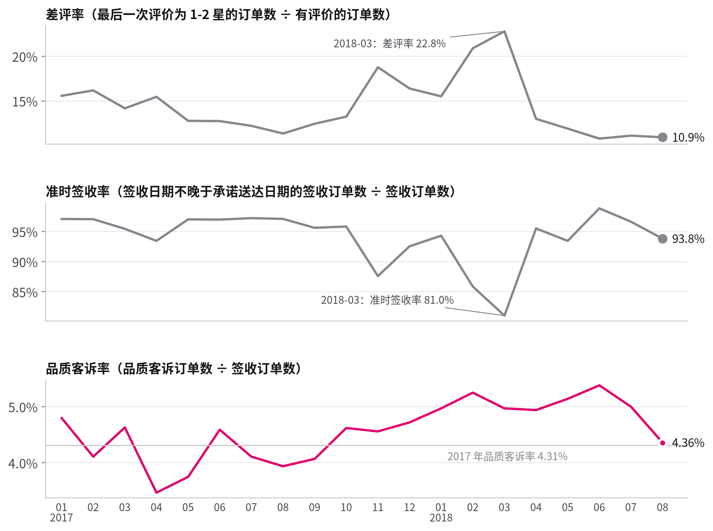

*图 1　差评率、准时签收率与品质客诉率（三个指标量纲不同，分开画，不使用双轴）*

差评率与准时签收率几乎是镜像：下单月 2018-03 准时签收率降到 81.0%，差评率升到 22.8%；2018-08 准时签收率回到 93.8%，差评率回落到 10.9%。品质客诉率的走势与之无关。

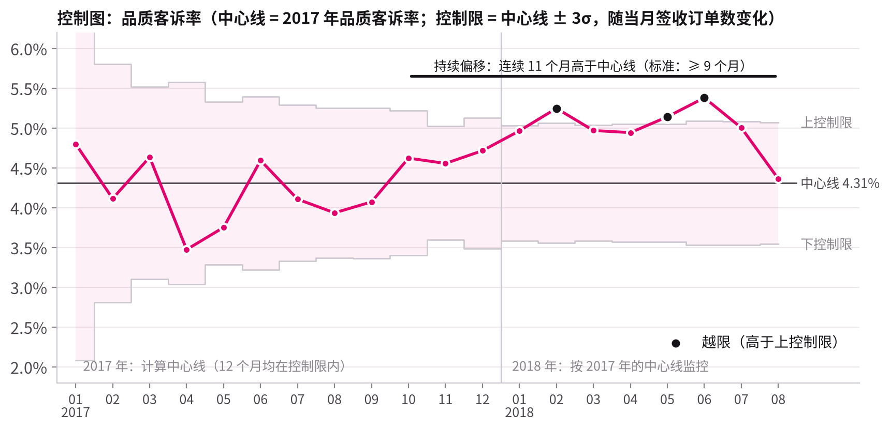

*图 2　品质客诉率控制图（中心线 = 2017 年品质客诉率 4.31%；控制限 = 中心线 ± 3σ，随当月签收订单数变化）*

控制图：中心线 = 2017 年的品质客诉率 4.31%；上控制限 / 下控制限 = 中心线 ± 3 × √（中心线 × (1 − 中心线) ÷ 当月签收订单数）。2017 年 12 个月均在控制限内；2018-02、2018-05、2018-06 越限（当月品质客诉率高于上控制限）；2017-10 至 2018-08 连续 11 个月高于中心线，构成持续偏移。

| 检验 | 结果 | 结论 |
|---|---|---|
| 2017 年 vs 2018 年 1-8 月品质客诉率（两比例 z 检验） | z = 5.05，p < 0.0001 | 显著上升 |
| 95% 置信区间（Wilson） | 2017 年 4.12% 至 4.50%；2018 年 1-8 月 4.82% 至 5.19% | 区间不重叠 |
| 货不对板客诉率 / 假货客诉率 | z = 5.19（p < 0.0001）/ z = 3.51（p < 0.01） | 均显著上升 |

最后一个月：2018-08 品质客诉率回落到 4.36%（2018-07 为 5.00%）。评价回收率（有评价的签收订单 ÷ 签收订单）8 月 99.7%、7 月 99.4%，相当；只统计签收后 7 天内提交的评价，8 月 4.13% 仍低于 7 月 4.78%。但与 7 月的差异不显著（z = -1.70，p = 0.09），且仍在控制限内，只能作为回落信号继续观察。

**动作**：考核品控用品质客诉率，差评率只作为体验指标观察；每月用控制图判断是否越限或持续偏移。

### 3.2 结论②：差评里品质问题的占比在上升

**关键术语**：差评品质原因占比——最后一次评价为差评（1-2 星）的订单中，主标签属于品质问题标签的订单所占的比例（分母含无文字的差评）。

**结论**：差评品质原因占比从 2017Q1 的 21.9% 升到 2018Q3 的 35.2%。

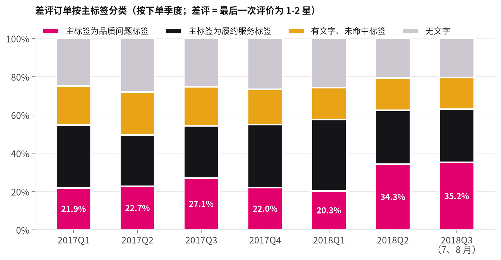

*图 3　差评订单按主标签分类（按下单季度；2018Q3 只有 7、8 两个月）*

2017 年四个季度，差评品质原因占比在 21.9% 至 27.1% 之间；2018Q2、2018Q3 为 34.3%、35.2%。主标签为履约服务标签的差评占比在 2018Q1 最高（37.3%），之后回落。

**动作**：物流问题缓解之后，差评里剩下的品质问题交给品控治理。

### 3.3 结论③：上升来自组内效应

**关键术语**：组内效应——Σ（2017 年各一级类目签收订单占比 × 该类目品质客诉率的变化），衡量同一类目自身变差带来的变化；结构效应 = Σ（各类目签收订单占比的变化 × 2017 年该类目品质客诉率）。

**结论**：品质客诉率变化 +0.69pp，其中组内效应 +0.74pp、结构效应 −0.01pp、交互项 −0.04pp：上升来自同一类目自身变差，而不是卖了更多高品质客诉率的类目。

整体品质客诉率 = Σ（各一级类目签收订单占比 × 该类目品质客诉率），所以两期之差 = 结构效应 + 组内效应 + 交互项。按单件订单 / 多件订单分解，结构效应同样很小（−0.01pp）。组内效应最大的一级类目依次是：3C数码、钟表与潮流好物、家居家纺、母婴玩具。

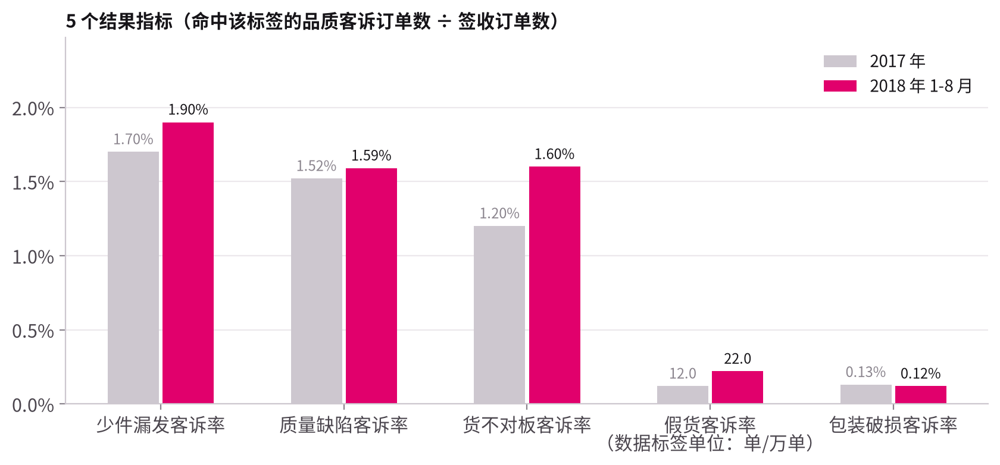

*图 4　5 个结果指标：2017 年 vs 2018 年 1-8 月*

分标签看：货不对板客诉率 1.20% → 1.60%，假货客诉率 12.0 单/万单 → 22.0 单/万单，少件漏发客诉率 1.70% → 1.90%，质量缺陷客诉率 1.52% → 1.59%。问题更多出在"描述与实物不符"和"正品"，而不是商品质量本身。

**动作**：治理对象是具体类目里的订单、商家和商品，而不是调整品类结构。

### 3.4 问题①：多件订单

**关键术语**：多件订单——件数不少于 2 的签收订单（件数 = 订单包含的商品行数），分为同 SKU 多件、单商家多 SKU、多商家三类。

**结论**：多件订单占签收订单 10.0%，贡献 33.6% 的品质客诉订单，增加的部分主要是少件漏发。

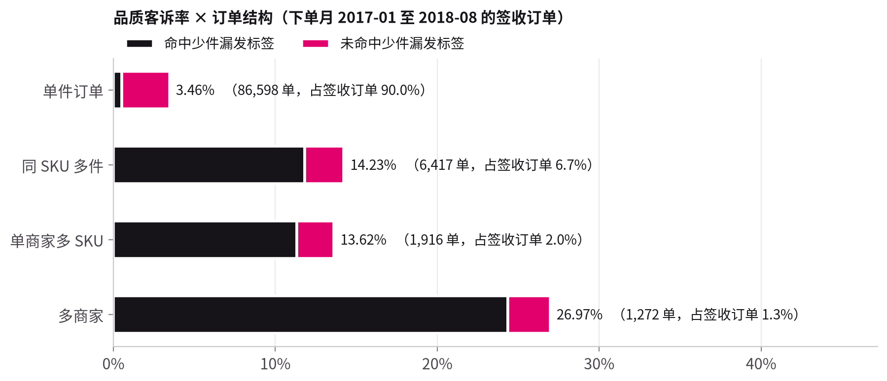

*图 5　不同订单结构的品质客诉率（下单月 2017-01 至 2018-08；黑色为命中少件漏发标签的部分）*

| 订单结构 | 签收订单数 | 占签收订单 | 品质客诉率 | 少件漏发客诉率 | 差评率 |
|---|---|---|---|---|---|
| 单件订单 | 86,598 | 90.0% | 3.46% | 0.53% | 11.3% |
| 同 SKU 多件 | 6,417 | 6.7% | 14.23% | 11.83% | 23.2% |
| 单商家多 SKU | 1,916 | 2.0% | 13.62% | 11.33% | 24.9% |
| 多商家 | 1,272 | 1.3% | 26.97% | 24.37% | 47.1% |

多件订单品质客诉率 15.79%，是单件订单 3.46% 的 4.6 倍；全部少件漏发客诉订单中，73.7% 来自多件订单。多件订单中命中少件漏发标签的品质客诉订单，99.8% 的评价日期不早于签收日期：不是"还没收齐就评价"，而是签收后确实缺件——漏发，或分包裹没有同时送达、也没有告知用户。两种情况都指向出库环节。

**动作**：举措 A：多件订单出库复核 + 分包裹提醒（见第 5 章）。

### 3.5 问题②：高风险商家

**关键术语**：高风险商家——参评商家中，平滑品质客诉率 ≥ 商家基准品质客诉率 × 2，且商家品质客诉订单不少于 3 单的商家。

**结论**：10 家高风险商家占参评商家的 3.3%、商家签收订单的 3.6%，贡献 12.5% 的商家品质客诉订单；回测中下一个 6 个月仍是商家基准品质客诉率的 2.2 倍。

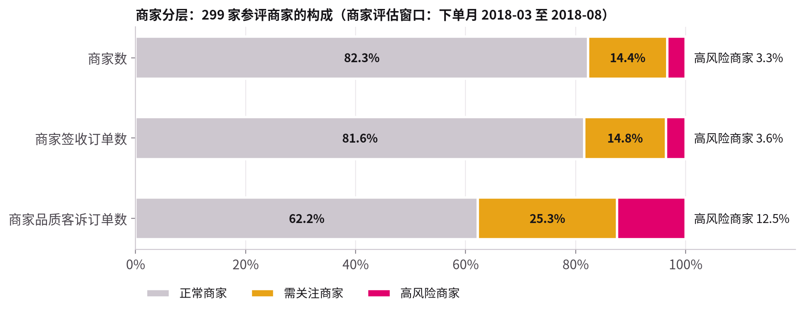

*图 6　299 家参评商家的构成（商家评估窗口：下单月 2018-03 至 2018-08）*

- 参评商家：商家评估窗口内商家签收订单不少于 30 单的商家；一个订单含多个商家时，每个商家各计 1 单（商家签收订单、商家品质客诉订单）。
- 商家基准品质客诉率 = 商家评估窗口内全部商家的商家品质客诉订单之和 ÷ 商家签收订单之和 = 5.33%；一个订单含多个商家时重复计入，所以不等于品质客诉率。
- 平滑品质客诉率 =（商家品质客诉订单数 + 50 × 商家基准品质客诉率）÷（商家签收订单数 + 50）：给每个商家先加 50 单"商家基准水平"的虚拟订单，避免"10 单里 1 单 = 10%"的小样本商家被误判。
- 商家品质分 = 品质客诉率 50% + 差评率 20% + 发货超时率 15% + 准时签收率 15%，每项按参评商家中的百分位排名打分，只用于商家之间排序。

| 商家分层 | 商家数 | 商家签收订单数 | 商家品质客诉订单数 | 品质客诉率 | 商家品质客诉订单占比 |
|---|---|---|---|---|---|
| 正常商家 | 246 | 22,080 | 908 | 4.11% | 62.2% |
| 需关注商家 | 43 | 4,002 | 369 | 9.22% | 25.3% |
| 高风险商家 | 10 | 976 | 182 | 18.65% | 12.5% |

名单是否可信，做了两项检验。① 显著性：10 家高风险商家的 Wilson 95% 置信区间下限都高于商家基准品质客诉率；如果不平滑、只看未平滑的品质客诉率 ≥ 商家基准 × 2，28 家参评商家中有 4 家并不显著。② 回测：用一个 6 个月窗口（训练期）分层，看同一批商家在接下来 6 个月（检验期）的表现。

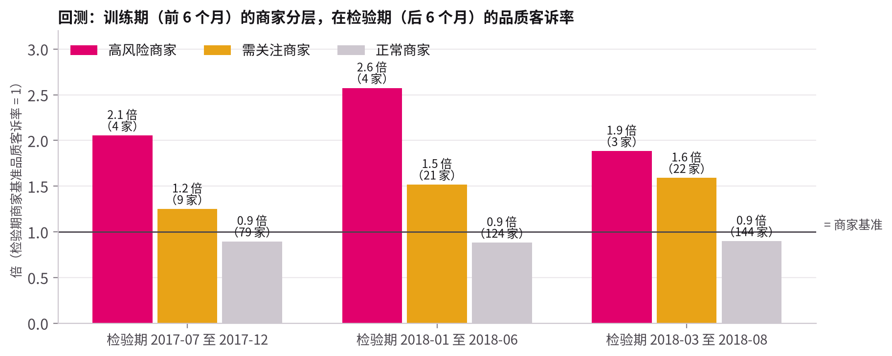

*图 7　回测：检验期品质客诉率 ÷ 检验期商家基准品质客诉率（3 组窗口）*

- 3 组窗口按商家数加权：高风险商家（11 家次）2.2 倍，需关注商家 1.5 倍，正常商家 0.9 倍；每组窗口的排序都成立。
- 对照：未平滑的品质客诉率 ≥ 商家基准 × 2 的规则圈出 83 家次，检验期只有 1.7 倍：平滑后名单更短、倍数更高。
- 回落：2 组窗口中，高风险商家的品质客诉率从训练期到检验期回落（13.29% → 9.66%，15.31% → 10.04%）。评估整改效果必须设对照组，否则会把自然回落误判为整改成果。

**动作**：举措 B：高风险商家和需关注商家整改；评估效果时设对照组。

### 3.6 问题③：假货与高风险品类

**关键术语**：假货客诉率——命中假货标签的品质客诉订单数 ÷ 签收订单数，以"单/万单"表示（每 1 万个签收订单中的个数）。

**结论**：假货集中在电脑配件（66.2 单/万单）和钟表礼品（53.0 单/万单），全部签收订单为 17.7 单/万单（下单月 2017-01 至 2018-08，按主品类）。

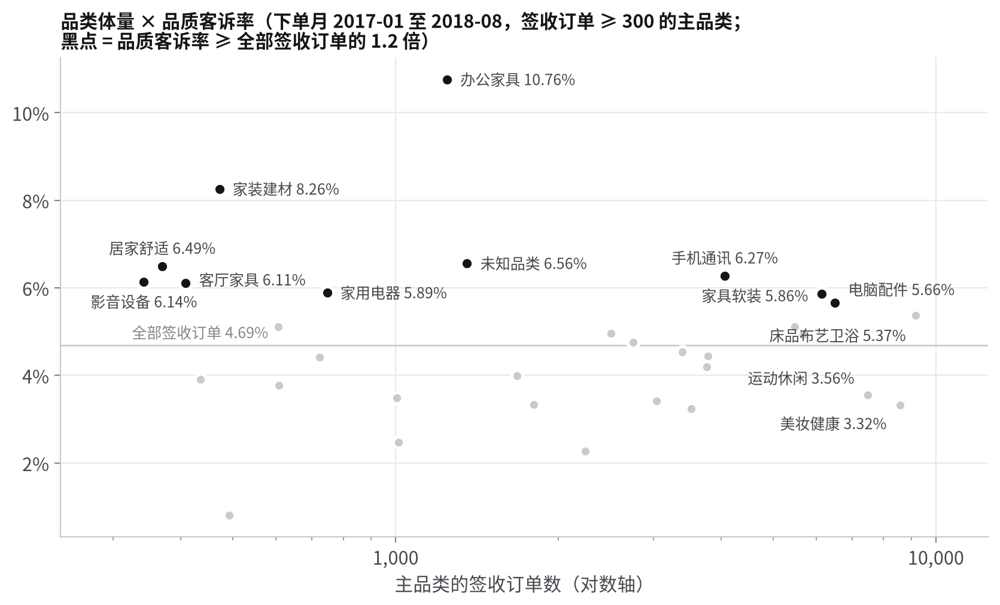

*图 8　主品类的体量与品质客诉率（下单月 2017-01 至 2018-08，签收订单 ≥ 300 的主品类）*

- 办公家具：品质客诉率 10.76%，是全部签收订单（4.69%）的 2.3 倍；少件漏发客诉率 5.78%，质量缺陷客诉率 4.42%。单件订单中主商品重量 ≥ 15kg 的，品质客诉率 6.26%，是 1-5kg 商品（3.16%）的 2.0 倍。
- 商品信息缺失：单件订单中，主商品缺少品类、图片、描述信息的，假货客诉率 138.0 单/万单；有 1 张及以上图片的 15.9 单/万单。图片张数本身（1 张 vs 4 张及以上）与品质客诉率关系不大。

**动作**：举措 C：一级类目 3C数码、钟表与潮流好物的正品与商品描述专项；商品信息缺一项不允许上架。

### 3.7 品类结构：穿戴类

**关键术语**：品类结构重加权——把穿戴类在签收订单中的占比从 9.2% 调为 75%，其余 25% 为非穿戴类，用两类各自 2018 年 1-8 月的指标重算整体指标；75% 取自唯品会 2024 年财报报道的穿戴类 GMV 占比，这里用 GMV 占比近似订单占比。

**结论**：穿戴类占比调为 75% 时，2018 年 1-8 月的假货客诉率从 22.0 单/万单 升到 45.1 单/万单，品质客诉率变化不大（5.00% → 5.05%）。

穿戴类：主品类属于一级类目"服饰鞋包"（箱包配饰、鞋靴、运动服饰、女装、男装、内衣泳装、旅行箱包），或主品类为"钟表礼品""童装"的签收订单。

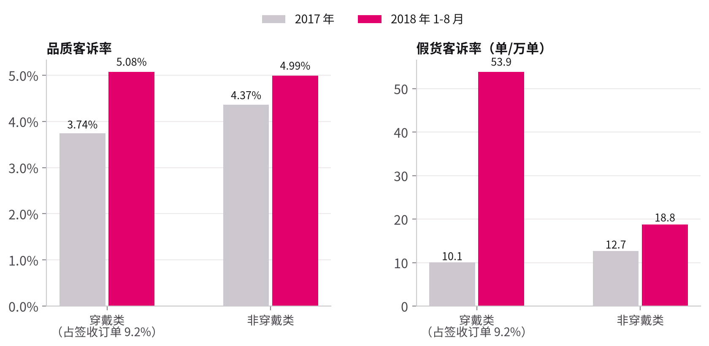

*图 9　穿戴类 vs 非穿戴类：品质客诉率与假货客诉率（2017 年 vs 2018 年 1-8 月）*

- 穿戴类品质客诉率 3.74% → 5.08%（z = 3.01，p < 0.01）；非穿戴类 4.37% → 4.99%。
- 穿戴类假货客诉率 10.1 → 53.9 单/万单，主要来自钟表礼品；非穿戴类 12.7 → 18.8 单/万单。
- 服装（主品类为男装、女装、鞋靴、内衣泳装、运动服饰，共 513 个签收订单）货不对板客诉率 4.48%（95% 置信区间 3.01% 至 6.64%）：尺码、颜色、材质与描述不符是服装的主要品质问题。Olist 的服装样本小，结论是方向性的。

外部参考：国家市场监督管理总局的产品质量抽查结果（数字取自公告及其新闻转载，引用前应核对原文，出处见 data/external/README.md）。

| 年份 | 抽查范围 | 产品 | 批次 / 不合格批次 | 不合格率 | 要点 |
|---|---|---|---|---|---|
| 2023 | 全年国家监督抽查 | 143种产品合计 | 28,265 / 3,476 | 12.3% | 生产领域16021批次不合格率6.7%；流通领域12244批次不合格率19.6% |
| 2023 | 全年国家监督抽查 | 按企业规模 | — | — | 大型企业0.8%；中型企业2.2%；小型企业13.2% |
| 2023 | 全年国家监督抽查 | 家用电器（26种） | — | 20.7% | — |
| 2023 | 电商平台（15家） | 羽绒服装 | 185 / 26 | 14.1% | 19批次纤维含量不合格；6批次含绒量不合格；1批次涉嫌假冒 |
| 2023 | 电商平台（18家） | 玩具 | 224 / 14 | 6.3% | 不合格项均为安全项目（塑料袋/薄膜、小零件、增塑剂） |
| 2023 | 电商平台（14家） | 学生书包 | 86 / 25 | 29.1% | — |
| 2022 | 网售产品（20家电商平台） | 羽绒服装、儿童及婴幼儿服装等19种 | 2,204 / 373 | 16.9% | 不合格批次中71.6%涉及安全项目 |

与本项目方向一致的两点：电商渠道羽绒服不合格的主因是纤维含量、含绒量与标称不符，属于货不对板；小型企业、流通领域的不合格率明显高于大型企业、生产领域（见上表要点），支持按供应商规模和历史表现分配抽检（见 5.4）。

**动作**：穿戴类入仓质检把成分、标签与商品描述是否一致列为必检项。

## 4. 不成立或证据不足的假设

| 假设 | 结论 | 证据 | 对决策的含义 |
|---|---|---|---|
| 新入驻商家品质更差 | 不成立 | 入驻不足 3 个月的商家 4.94%，入驻 12 个月以上 5.38%（按商家签收订单计算，下单月 2017-07 至 2018-08；入驻时长 = 下单时间 − 商家第一个订单的时间） | 治理重点放在存量商家的持续监控 |
| 送晚了导致更多损坏 | 不成立 | 延迟签收订单品质客诉率 2.99%，准时签收订单 4.81%；包装破损客诉率 0.11% vs 0.12%（延迟签收订单：签收日期晚于承诺送达日期的签收订单） | 物流时效与品质问题分开治理 |
| 首单遇到品质问题会流失 | 证据不足 | 首单为品质客诉订单的用户复购率 3.9%，首单 5 星 4.3%，全部用户 4.1%（复购率：首单早于 2018-03-01、首单签收且有评价的用户中，分析范围内下过 2 个及以上订单的用户所占比例） | 需要会员与复购数据验证 |

## 5. 举措与治理测算

### 5.1 治理测算

**关键术语**：治理测算——以 2018 年 1-8 月的签收订单为基期，估算三项举措实施后的品质客诉率；一个品质客诉订单被多项举措覆盖时，避免概率按 1 − Π(1 − 各举措降幅) 叠加。

**结论**：中性情景下，三项举措把品质客诉率从 5.00% 降到 3.82%。

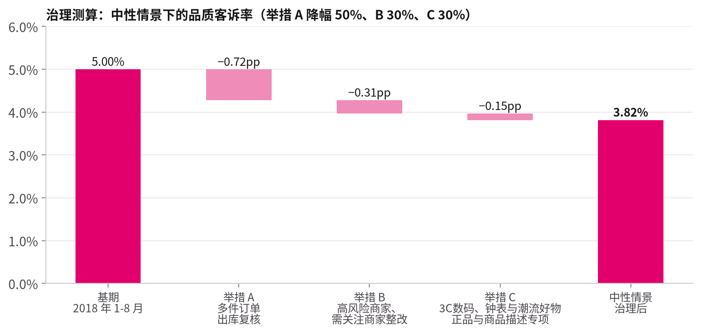

*图 10　治理测算：中性情景下三项举措对品质客诉率的影响*

| 举措 | 作用对象 | 中性降幅 | 品质客诉率变化 | 跟踪指标 |
|---|---|---|---|---|
| A 多件订单出库复核 + 分包裹提醒 | 多件订单中命中少件漏发标签的品质客诉订单 | 50% | −0.72pp | 多件订单少件漏发客诉率 |
| B 高风险商家和需关注商家整改 | 主商家为高风险商家或需关注商家的品质客诉订单 | 30% | −0.31pp | 高风险商家数、高风险商家整改完成率 |
| C 3C数码、钟表与潮流好物正品与商品描述专项 | 主品类属于这两个一级类目、且命中假货或货不对板标签的品质客诉订单 | 30% | −0.15pp | 假货客诉率、货不对板客诉率 |
| 合计 | 基期 52,777 个签收订单 |  | 5.00% → 3.82% | 品质客诉率 |

**动作**：降幅是假设参数，和业务方一起校准后再更新测算。

### 5.2 情景与敏感性

**关键术语**：情景——举措降幅的三组假设：悲观（A 30%、B 15%、C 15%）、中性（50%、30%、30%）、乐观（70%、45%、45%）。

**结论**：悲观情景 4.32%，中性 3.82%，乐观 3.34%；最敏感的是举措 A 的降幅。

| 情景 | 举措 A 降幅 | 举措 B 降幅 | 举措 C 降幅 | 治理后品质客诉率 |
|---|---|---|---|---|
| 悲观情景 | 30% | 15% | 15% | 4.32% |
| 中性情景 | 50% | 30% | 30% | 3.82% |
| 乐观情景 | 70% | 45% | 45% | 3.34% |

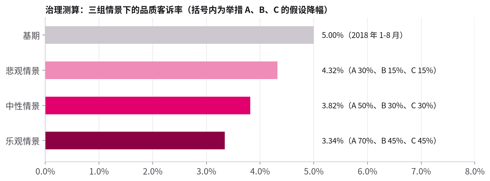

*图 11　治理测算：三组情景下的品质客诉率*

单因素敏感性（每次只改一项举措的降幅，其余取中性值）：举措 A 从悲观取到乐观，治理后品质客诉率相差 0.54pp，影响最大。测算基于规则识别的品质客诉订单；如果漏标在各类订单中分布相近，按真实值换算后降幅比例基本不变。

**动作**：上线后最先用试点验证举措 A 的真实降幅。

### 5.3 举措说明

**关键术语**：举措 A / B / C——分别作用于多件订单、高风险商家和需关注商家、一级类目 3C数码、钟表与潮流好物，与第 3 章的三处问题一一对应。

**结论**：三项举措分别落在仓配出库、商家管理、商品准入三个环节。

- A：多件订单出库前称重或逐件扫码复核；必须分包裹时，在订单页和消息里告知"您的订单分 N 个包裹发出"；评价邀请延后到全部包裹签收之后。
- B：高风险商家 30 天整改期（下架问题商品、补充商品信息、发货复核），复评仍为高风险商家则限流；需关注商家每周跟踪。
- C：入驻时核验品牌授权；对假货客诉率高的商品抽检；商品详情必须包含型号、规格、实拍图，缺一项不允许上架（动销商品信息完整率目标 100%）。

**动作**：每项举措指定跟踪指标（见 5.1 表），在看板上每月复盘。

### 5.4 差异化抽检

**关键术语**：问题订单覆盖率——按风险分从高到低抽检一定比例的签收订单时，抽到的问题订单数 ÷ 全部问题订单数；入仓类问题订单 = 命中质量缺陷、货不对板或假货标签的品质客诉订单，出库类问题订单 = 命中少件漏发标签的品质客诉订单。

**结论**：出库只复核多件订单，就能覆盖 75.4% 的出库类问题订单；入仓抽检 10% 时，按商家 × 品类风险分抽检的覆盖率 15.7%，随机顺序 10.3%。

风险分用 2017-09 至 2018-02 的签收订单计算（商家风险分 = 主商家的平滑入仓类问题率；商家 × 品类风险分再乘以主品类的平滑入仓类问题率 ÷ 全部签收订单的入仓类问题率），在下单月 2018-03 至 2018-08 的 39,153 个签收订单上检验（样本外）。

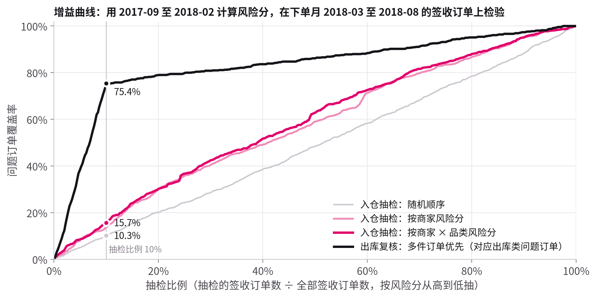

*图 12　增益曲线：横轴为抽检比例，纵轴为问题订单覆盖率（样本外检验）*

- 出库复核：多件订单占签收订单 10.0%，复核全部多件订单即可覆盖 75.4% 的出库类问题订单，少件漏发几乎被订单结构锁定。
- 入仓抽检：抽检比例 10% 时，商家 × 品类风险分 15.7% vs 随机顺序 10.3%（1.5 倍）；抽检比例 20% 时 30.2% vs 20.1%。
- 入仓抽检提升有限，是因为公开数据只有商家和品类两个特征；接入商家历史质检结果、品牌授权、商品信息完整度后，风险分会更准。

**动作**：入仓抽检按商家 × 品类风险分排序；接入商家历史质检结果后重新计算风险分。

### 5.5 效果评估

**关键术语**：双重差分——（试点组实施后 − 实施前）−（对照组同期的后 − 前），用来剔除同期的共同变化。

**结论**：举措 A、C 先在部分仓库或商家试点，用双重差分评估效果。

试点观察 8 周；同时跟踪平均发货时长和发货超时率，防止复核拖慢发货。举措 B 要注意回落：被选为高风险商家的商家即使不干预，下期品质客诉率也可能回落（见 3.5），所以同样需要对照组。

**动作**：先在部分仓库试点举措 A，用试点组相对对照组的变化评估效果。

## 6. 局限与下一步

- 评价不等于客诉记录：标签精确率 97.4%、标签召回率 74.5%，品质客诉率的绝对值偏低；两年的标签召回率相近，趋势结论不受影响。接入客服记录与退货原因后可以交叉验证。
- 没有入仓质检、抽检数据：入仓质检合格率、问题商品拦截率、品质退货率的口径已在指标字典中定义，接入后可以把结果指标和过程指标连起来。
- 单一平台：品类结构、履约模式与其他平台不同；方法可以迁移，平滑参数（50 单）、预警规则需要用新数据重新校准。
- 最近月份的订单还有一部分没有签收或评价，最近 1-2 个月的数字会被后续评价修正，周报中需要标注。
- 外部参考数据（监管抽查结果、穿戴类 GMV 占比）取自公告、新闻转载与财报报道，引用前应核对原文。

## 附录：项目文件

| 内容 | 位置 |
|---|---|
| 术语与口径 | docs/00_术语与口径.md |
| 指标体系与指标字典 | docs/02_指标体系.md、docs/品控指标字典.xlsx |
| 交互看板与 BI 搭建指南 | dashboard/index.html、docs/04_BI看板设计与搭建指南.md |
| SQL 取数题库（19 题） | docs/05_SQL面试题库.md、sql/interview/ |
| 数仓 SQL | sql/01_ods_ddl.sql 至 sql/06_ads.sql |
| 分析明细表 | outputs/analysis_tables.xlsx、outputs/advanced_tables.xlsx |
| 数据校验报告、标注样本（含中文释义） | outputs/qa/ |
| 商家品质月报模板（Excel 公式 + 数据透视表） | docs/商家品质月报模板.xlsx |
| 面试讲稿 | docs/10_面试讲稿.md |
| 外部参考数据 | data/external/ |
